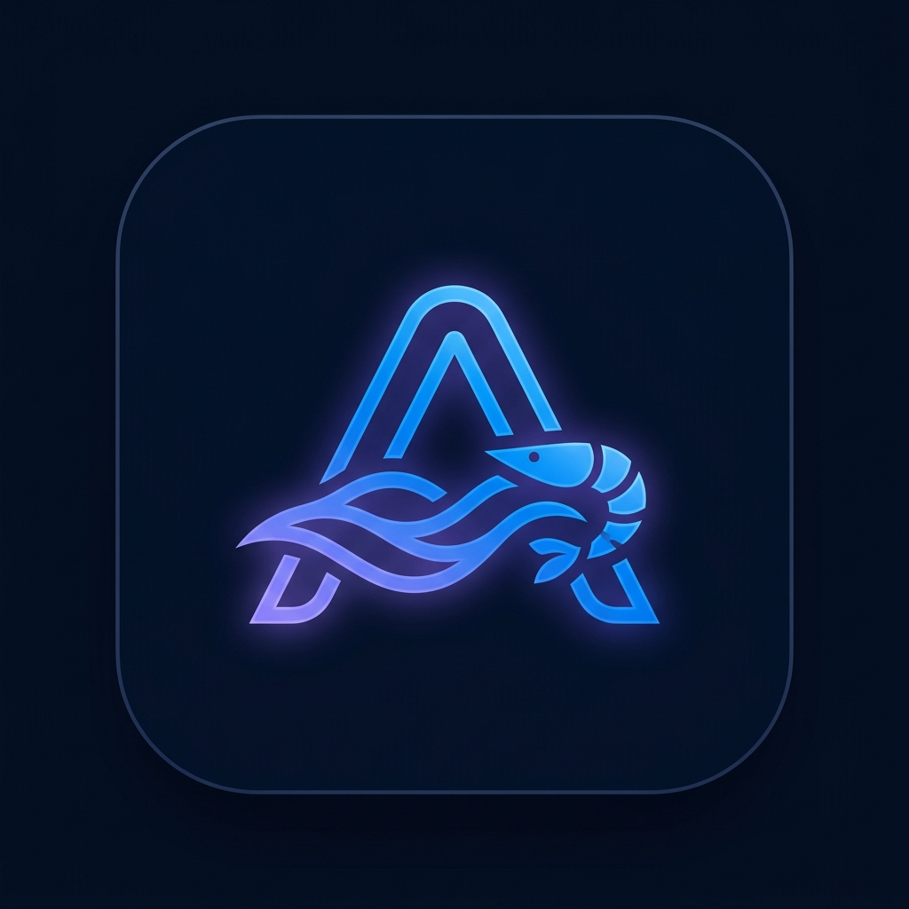

<div align="center">



# 🦐 Tambak Udang Sampang

### **AquiTech — Sistem Monitoring & Manajemen Tambak Udang Berbasis IoT & AI**

*Platform terpadu real-time untuk memantau kualitas air, mengelola produksi, pakan, panen, dan perangkat IoT pada tambak udang modern.*

---

[](https://react.dev)
[](https://lumen.laravel.com)
[](https://vitejs.dev)
[](https://mqtt.org)
[](https://mysql.com)
[](https://jwt.io)
[](https://threejs.org)
[](https://framer.com/motion)

</div>

---

## 📋 Daftar Isi

- [🎯 Tentang Project](#-tentang-project)
- [✨ Fitur Unggulan](#-fitur-unggulan)
- [🏗️ Arsitektur Sistem](#-arsitektur-sistem)
- [🛠️ Tech Stack](#-tech-stack)
- [📁 Struktur Project](#-struktur-project)
- [📋 Prerequisites](#-prerequisites)
- [🔧 Instalasi & Setup](#-instalasi--setup)
- [⚙️ Konfigurasi Environment](#-konfigurasi-environment)
- [📚 API Documentation](#-api-documentation)
- [🚀 Penggunaan](#-penggunaan)
- [🗺️ Roadmap](#-roadmap)
- [🤝 Kontribusi](#-kontribusi)
- [📄 Lisensi](#-lisensi)

---

## 🎯 Tentang Project

**Tambak Udang Sampang** adalah sistem manajemen tambak udang modern yang mengintegrasikan **perangkat IoT**, **monitoring real-time berbasis MQTT**, dan **dashboard manajemen berbasis web**. Dibangun untuk membantu para petambak udang dalam:

- 📊 **Memantau kualitas air** (suhu, pH, DO, TDS) secara real-time dari sensor IoT ESP32
- 📈 **Mengelola siklus produksi** dari penebaran benur hingga panen dengan log harian
- 🧮 **Menghitung kebutuhan pakan** otomatis dan mencatat riwayat pemberian pakan per kolam
- 🏷️ **Mencatat hasil panen** (parsial/total) dengan detail ukuran, berat, dan harga pasar
- 🔔 **Mendapatkan notifikasi push** jika parameter air melebihi ambang batas normal
- 🌐 **Mengelola kolam, perangkat IoT, relay, dan pengguna** dalam satu platform terpadu

> Proyek ini dibangun dalam dua bagian utama:
> - **`/api`** — RESTful API berbasis Laravel Lumen dengan JWT authentication & MQTT listener daemon
> - **`/web`** — Single Page Application React dengan visualisasi 3D, animasi GSAP/Framer Motion, dan monitoring real-time

---

## ✨ Fitur Unggulan

### 🖥️ Frontend Web

| Fitur | Deskripsi |
|-------|-----------|
| **Landing Page 3D Interaktif** | Animasi Three.js, parallax scroll, ShinyText effect, GSAP SplitText, smooth transitions |
| **Dashboard Admin** | Ringkasan produksi, status seluruh kolam, dan grafik perkembangan |
| **Manajemen Kolam** | CRUD kolam lengkap dengan detail luas, kincir, status benur |
| **Monitoring Real-time** | Data sensor (suhu, pH, DO, TDS) diperbarui langsung via MQTT WebSocket |
| **Produksi & Log Harian** | Catat siklus produksi, log harian (pakan, MBW, kematian, kualitas air) |
| **Manajemen Pakan** | Catat pemberian pakan mingguan dengan statistik agregat |
| **Manajemen Panen** | Catat hasil panen parsial/total dengan ukuran dan harga |
| **Manajemen Perangkat IoT** | Kelola perangkat ESP32, sensor, dan relay otomatisasi |
| **Manajemen Pengguna** | CRUD pengguna dengan role-based access (Super Admin, Admin) |
| **Sistem Auth JWT** | Login/register aman dengan token-based authentication |
| **Responsive Mobile** | Collapsible sidebar, mobile-first layout, smooth UX di semua perangkat |
| **Notifikasi Toast Modular** | Alert profesional dengan animasi spring — success, error, warning, info |

### ⚙️ Backend API

| Fitur | Deskripsi |
|-------|-----------|
| **RESTful API** | Endpoint lengkap untuk semua fitur manajemen tambak |
| **JWT Authentication** | Auth aman menggunakan `tymon/jwt-auth` |
| **Role-Based Access Control** | Middleware untuk Super Admin, Admin, dan User biasa |
| **MQTT Integration** | Subscribe & publish data sensor IoT secara real-time via `php-mqtt/client` |
| **Firebase Push Notification** | Kirim notifikasi ke perangkat mobile jika ada anomali sensor |
| **Rate Limiting** | Proteksi endpoint dengan throttle middleware |
| **CORS Middleware** | Aman untuk koneksi cross-origin dari frontend |
| **Input Sanitization** | Perlindungan dari XSS dan SQL injection |

---

## 🏗️ Arsitektur Sistem

```
╔══════════════════════════════════════════════════════════════╗
║                   IoT Devices (ESP32)                        ║
║          Sensor: Suhu · pH · DO · TDS · Water Level         ║
╚══════════════╦═══════════════════════════╦═══════════════════╝
               ║                           ║
               ║  MQTT (wss://broker)      ║
               ▼                           ▼
╔══════════════════════╗     ╔══════════════════════════════╗
║    MQTT Broker       ║◄───►║   MQTT Listener Daemon       ║
║  (Mosquitto Cloud)   ║     ║  (Laravel Artisan Command)   ║
╚══════════════════════╝     ╚══════════════╦═══════════════╝
                                            ║ Subscribe & Process
                                            ▼
╔══════════════════════════════════════════════════════════════╗
║                  Backend API  (Lumen 10)                     ║
║                                                              ║
║  Auth (JWT)  │  Kolam  │  Produksi  │  Pakan  │  Panen      ║
║  Monitoring  │  Devices │  Relay    │  Users  │  Laporan    ║
╚════════╦═════════════════════════════════════╦═══════════════╝
         ║  REST API (HTTP/JSON)               ║  Firebase FCM
         ▼                                     ▼
╔══════════════════════════╗     ╔══════════════════════════╗
║  Frontend Web (React)    ║     ║  Firebase Cloud          ║
║                          ║     ║  Messaging (Push Notif)  ║
║  • Landing Page 3D       ║     ╚══════════════════════════╝
║  • Dashboard Admin       ║
║  • Real-time Monitoring  ║
║  • Management Panels     ║
║  • MQTT Client (WS)      ║
╚══════════════════════════╝
```

---

## 🛠️ Tech Stack

### Backend (`/api`)

| Teknologi | Versi | Kegunaan |
|-----------|-------|----------|
| **Laravel Lumen** | 10 | Micro-framework PHP untuk REST API cepat |
| **MySQL** | 8.0+ | Database relasional utama |
| **tymon/jwt-auth** | latest | JWT Authentication |
| **php-mqtt/client** | latest | MQTT client untuk data IoT real-time |
| **kreait/firebase-php** | latest | Firebase Cloud Messaging (push notif) |
| **doctrine/dbal** | latest | Migrasi database lanjutan |

### Frontend (`/web`)

| Teknologi | Versi | Kegunaan |
|-----------|-------|----------|
| **React** | 19 | Library UI modern dengan Concurrent Mode |
| **Vite** | 8 | Build tool ultra-cepat |
| **React Router** | 7 | Routing SPA dengan lazy loading |
| **Framer Motion** | latest | Animasi halaman & komponen yang smooth |
| **GSAP + ScrollTrigger** | latest | Animasi performa tinggi, SplitText, parallax |
| **Three.js / @react-three/fiber** | latest | Visualisasi 3D interaktif di landing page |
| **Locomotive Scroll** | latest | Smooth scrolling premium |
| **Axios** | latest | HTTP client untuk API calls |
| **MQTT.js** | latest | WebSocket MQTT client real-time |
| **Chart.js / react-chartjs-2** | latest | Grafik dan chart interaktif |
| **Leaflet / react-leaflet** | latest | Peta interaktif untuk lokasi kolam |
| **React Icons** | latest | Icon library lengkap |

---

## 📁 Struktur Project

```
Tambak-Udang-Sampang/
│
├── api/                                    # 🔧 Backend Laravel Lumen
│   ├── app/
│   │   ├── Console/Commands/               # MQTT Listener Daemon
│   │   ├── Http/
│   │   │   ├── Controllers/               # API Controllers
│   │   │   │   ├── AuthController         # Login / Register / Logout
│   │   │   │   ├── KolamController        # Manajemen kolam
│   │   │   │   ├── ProduksiController     # Siklus produksi
│   │   │   │   ├── PakanController        # Manajemen pakan
│   │   │   │   ├── PanenController        # Manajemen panen
│   │   │   │   ├── MonitoringController   # Data sensor IoT
│   │   │   │   ├── DeviceController       # Perangkat IoT
│   │   │   │   ├── RelayController        # Kontrol relay
│   │   │   │   ├── UserController         # Manajemen user
│   │   │   │   ├── LaporanController      # Laporan & agregasi
│   │   │   │   └── PublicStatsController  # Public API (tanpa auth)
│   │   │   └── Middleware/                # JWT · CORS · Role · RateLimit
│   │   └── Models/                        # Eloquent ORM Models
│   ├── database/
│   │   ├── migrations/                    # Database migrations
│   │   └── seeders/                       # Database seeders
│   └── routes/api.php                     # Definisi semua API routes
│
└── web/                                   # 🌐 Frontend React SPA
    ├── public/
    │   ├── favicon.png                    # 🦐 AquiTech App Icon
    │   └── hero-aquaculture.jpg           # Background hero
    └── src/
        ├── components/
        │   ├── admin/                     # DashboardLayout (collapsible sidebar)
        │   ├── auth/                      # LoginModal
        │   ├── cards/                     # FeatureCards
        │   ├── common/                    # ShinyText · ToastContainer
        │   ├── hero/                      # HeroSection dengan SplitText & GSAP
        │   ├── landing/                   # LiveStatsSection · UsiaBenurSection
        │   └── layout/                    # Navbar · Footer · ParallaxBackground
        ├── core/
        │   ├── network/apiClient.js       # Axios instance dengan interceptor
        │   └── utils/toast.js             # Modular toast notification utility
        ├── pages/
        │   ├── admin/                     # Dashboard · Monitoring · Kolam
        │   │                              # Produksi · Pakan · Panen · Devices · Users
        │   └── LandingPage.jsx            # Public landing page
        └── styles/
            ├── dashboard.css              # Admin dashboard design system
            └── landing.css                # Landing page styles
```

---

## 📋 Prerequisites

Pastikan environment Anda memiliki:

| Requirement | Versi Minimal |
|-------------|---------------|
| **PHP** | ^8.1 |
| **Composer** | 2.x |
| **Node.js** | ^18 / ^20 |
| **npm** | 9+ / 10+ |
| **MySQL** | 5.7+ / 8.0 |
| **OpenSSL** | Untuk generate JWT secret |

---

## 🔧 Instalasi & Setup

### 1. Clone Repository

```bash
git clone https://github.com/CodeCraftersTeam01/Tambak-Udang-Sampang.git
cd Tambak-Udang-Sampang
```

### 2. Setup Backend (API)

```bash
cd api

# Install PHP dependencies
composer install

# Copy dan konfigurasi environment
cp .env.example .env

# Generate JWT secret key
php artisan jwt:secret

# Setup database MySQL, lalu jalankan migrasi & seeder
php artisan migrate --seed

# Jalankan development server
php -S 0.0.0.0:8000 -t public
```

> API berjalan di `http://localhost:8000`

### 3. Setup Frontend (Web)

```bash
cd ../web

# Install Node.js dependencies
npm install

# Copy dan konfigurasi environment
cp .env.example .env
# → Set VITE_API_URL=http://localhost:8000/api

# Jalankan development server
npm run dev
```

> Frontend berjalan di `http://localhost:5173`

### 4. Jalankan MQTT Listener (Opsional — untuk data sensor real-time)

```bash
cd api
php artisan mqtt:listen
```

---

## ⚙️ Konfigurasi Environment

### `api/.env`

```env
APP_NAME="Tambak Udang Sampang"
APP_ENV=local
APP_DEBUG=true
APP_URL=http://localhost:8000

DB_CONNECTION=mysql
DB_HOST=127.0.0.1
DB_PORT=3306
DB_DATABASE=tambak_udang
DB_USERNAME=root
DB_PASSWORD=

JWT_SECRET=<generated-by-jwt-secret>
JWT_TTL=3600

MQTT_HOST=broker.m-tech.fun
MQTT_PORT=1883
MQTT_USERNAME=
MQTT_PASSWORD=

FIREBASE_CREDENTIALS=storage/firebase/credentials.json
```

### `web/.env`

```env
VITE_API_URL=http://localhost:8000/api
```

---

## 📚 API Documentation

### 🌐 Public Endpoints

| Method | Endpoint | Deskripsi |
|--------|----------|-----------|
| `GET` | `/api/public/usia-benur` | Data usia benur seluruh kolam |
| `GET` | `/api/public/stats` | Statistik publik tambak |

### 🔐 Authentication

| Method | Endpoint | Deskripsi |
|--------|----------|-----------|
| `POST` | `/api/auth/login` | Login user (returns JWT token) |
| `POST` | `/api/auth/register` | Register user baru |
| `POST` | `/api/auth/logout` | Logout (invalidate token) |
| `GET` | `/api/auth/me` | Profil user yang sedang login |

### 🔒 Protected Endpoints *(JWT Required)*

#### Kolam
| Method | Endpoint | Deskripsi |
|--------|----------|-----------|
| `GET` | `/api/kolam` | List semua kolam |
| `POST` | `/api/kolam` | Tambah kolam baru |
| `GET` | `/api/kolam/{id}` | Detail kolam |
| `PUT` | `/api/kolam/{id}` | Update kolam |
| `DELETE` | `/api/kolam/{id}` | Hapus kolam |

#### Produksi
| Method | Endpoint | Deskripsi |
|--------|----------|-----------|
| `GET` | `/api/produksi` | List produksi |
| `POST` | `/api/produksi` | Mulai siklus produksi baru |
| `PUT` | `/api/produksi/{id}` | Update produksi |
| `GET` | `/api/produksi/log/{kolam_id}` | Log harian per kolam |
| `POST` | `/api/produksi/log` | Tambah log harian |

#### Pakan & Panen
| Method | Endpoint | Deskripsi |
|--------|----------|-----------|
| `GET` | `/api/pakan` | List catatan pakan |
| `POST` | `/api/pakan` | Tambah catatan pakan |
| `GET` | `/api/panen` | List panen |
| `POST` | `/api/panen` | Catat panen baru |
| `GET` | `/api/panen/statistik` | Statistik hasil panen |

#### Monitoring & Devices
| Method | Endpoint | Deskripsi |
|--------|----------|-----------|
| `GET` | `/api/monitoring/latest?pond_id={id}` | Data sensor terbaru per kolam |
| `GET` | `/api/devices` | List perangkat IoT |
| `PUT` | `/api/devices/{id}/calibration` | Kalibrasi sensor |
| `POST` | `/api/relay` | Kontrol relay (batch) |

#### Users *(Super Admin only)*
| Method | Endpoint | Deskripsi |
|--------|----------|-----------|
| `GET` | `/api/users` | List semua user |
| `POST` | `/api/users` | Tambah user |
| `PUT` | `/api/users/{id}` | Update user |
| `DELETE` | `/api/users/{id}` | Hapus user |

---

## 🚀 Penggunaan

### Akses Aplikasi

1. Buka `http://localhost:5173` di browser
2. Landing page menampilkan fitur, statistik live, dan data usia benur
3. Klik **"Mulai Pantau Tambak"** atau **"Sign In"** untuk membuka modal login
4. Masukkan kredensial (default seeder: `admin@example.com` / `password`)
5. Setelah login → diarahkan ke **Dashboard Admin**

### Alur Manajemen Tambak

```
1. Tambah Kolam        →  /admin/kolam        Kelola data kolam & lokasi
2. Mulai Produksi      →  /admin/produksi     Tebar benur, mulai siklus
3. Log Harian          →  /admin/produksi     Input pakan, MBW, kematian
4. Monitoring IoT      →  /admin/monitoring   Pantau sensor real-time
5. Catat Pakan         →  /admin/pakan        Input pemberian pakan
6. Catat Panen         →  /admin/panen        Parsial / panen total
7. Perangkat IoT       →  /admin/devices      Kelola sensor & relay
```

### MQTT Real-Time

Sistem terhubung otomatis ke broker MQTT untuk menerima data dari ESP32 di tambak. Parameter yang dipantau:

| Sensor | Satuan | Rentang Normal |
|--------|--------|----------------|
| 🌡️ Suhu Air | °C | 26 – 32°C |
| 🧪 pH Air | pH | 6.5 – 8.5 |
| 💨 DO (Dissolved Oxygen) | mg/L | 4 – 8 mg/L |
| 💧 TDS (Total Dissolved Solids) | ppm | 500 – 1500 ppm |

---

## 🗺️ Roadmap

- [x] Landing page 3D interaktif (Three.js + GSAP + Framer Motion)
- [x] CRUD kolam, produksi, pakan, panen
- [x] Monitoring real-time via MQTT WebSocket
- [x] JWT Authentication & Role-Based Access Control
- [x] Notifikasi toast modular (success, error, warning, info)
- [x] Smooth page transitions dengan Framer Motion
- [x] Responsive mobile dengan collapsible sidebar
- [x] ShinyText effect pada hero section
- [ ] **Laporan PDF** — Export laporan per kolam ke PDF
- [ ] **Notifikasi In-App Real-time** — WebSocket push ke dashboard
- [ ] **Mobile App** — React Native companion app
- [ ] **AI Anomaly Detection** — Prediksi dan deteksi anomali kualitas air
- [ ] **Grafik Tren Lanjutan** — Visualisasi tren sensor per minggu/bulan
- [ ] **Multi Tenant** — Dukungan multi pemilik tambak dalam satu platform

---

## 🤝 Kontribusi

Kontribusi sangat diterima! Berikut langkah-langkahnya:

```bash
# 1. Fork repository ini di GitHub

# 2. Clone fork Anda
git clone https://github.com/username-anda/Tambak-Udang-Sampang.git

# 3. Buat branch fitur baru
git checkout -b feat/nama-fitur-keren

# 4. Commit perubahan (gunakan Conventional Commits)
git commit -m "feat: tambah fitur prediksi kualitas air"

# 5. Push ke branch
git push origin feat/nama-fitur-keren

# 6. Buat Pull Request di GitHub
```

### Panduan Kontribusi

- Ikuti struktur kode yang sudah ada (component-based frontend, controller-service backend)
- Gunakan **Conventional Commits**: `feat:`, `fix:`, `refactor:`, `docs:`, `style:`
- Jangan ubah design system yang sudah ada di `dashboard.css` tanpa diskusi terlebih dahulu
- Pastikan kode telah ditest sebelum membuat Pull Request

---

## 📄 Lisensi

Hak Cipta © 2025 **Tambak Udang Sampang — CodeCraftersTeam01**

Dilarang mendistribusikan, memodifikasi, atau menggunakan perangkat lunak ini tanpa izin tertulis dari pemilik hak cipta.

---

<div align="center">

Dibuat dengan ❤️ untuk petambak udang Indonesia 🇮🇩

[⬆ Kembali ke Atas](#-tambak-udang-sampang)

</div>
